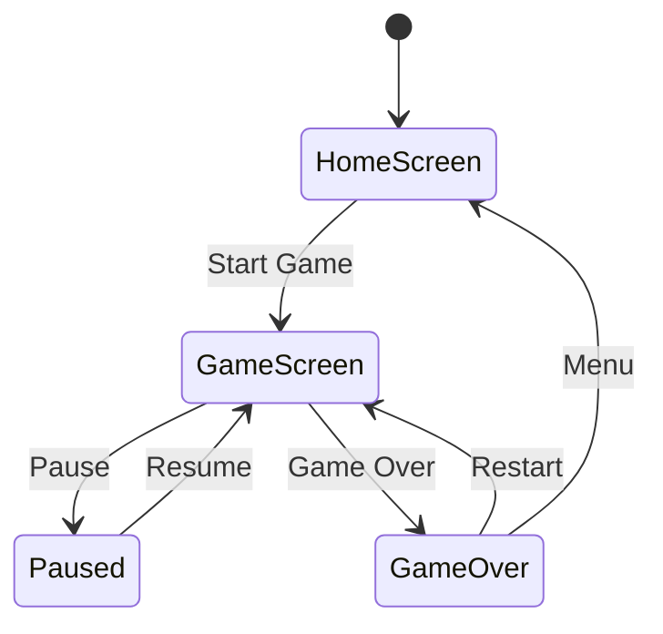

# Classic Snake Game - Flutter Implementation Design

## Table of Contents
1. [Overview](#1-overview)
2. [Architecture](#2-architecture)
3. [Component Architecture](#3-component-architecture)
4. [State Management](#4-state-management)
5. [UI/UX Design](#5-uiux-design)
6. [Technical Implementation](#6-technical-implementation)
7. [Performance Considerations](#7-performance-considerations)
8. [Testing Strategy](#8-testing-strategy)
9. [Future Enhancements](#9-future-enhancements)
10. [Conclusion](#10-conclusion)
11. [Development Roadmap](#11-development-roadmap)

## 1. Overview

This document outlines the design for implementing a modern, flashy version of the classic Snake game using Flutter. The game will feature smooth animations, vibrant visuals, and intuitive controls while maintaining the core gameplay mechanics of the original Snake game.

### Core Gameplay Features:
- Grid-based movement with automatic snake progression
- Direction control via swipe gestures or on-screen buttons
- Snake growth when consuming food
- Collision detection with walls and self
- Score tracking with high score persistence

### Modern UI Enhancements:
- Animated snake movement with smooth transitions
- Dynamic color themes (retro, neon, dark)
- Particle effects for food consumption
- Glowing elements and visual feedback
- Responsive design for all device sizes

## 2. Architecture

The application will follow a layered architecture with clear separation of concerns:

```
lib/
├── main.dart                 # Entry point
├── models/                   # Game data models
│   ├── snake.dart            # Snake logic and representation
│   ├── food.dart             # Food generation and logic
│   └── game_state.dart       # Game state management
├── screens/                  # UI screens
│   ├── home_screen.dart      # Main menu and settings
│   ├── game_screen.dart      # Main game interface
│   └── game_over_screen.dart # Game over and score display
├── widgets/                  # Reusable UI components
│   ├── game_board.dart       # Grid-based game board
│   ├── snake_widget.dart     # Snake rendering
│   ├── food_widget.dart      # Food rendering
│   └── controls.dart         # Direction controls
├── providers/                # State management
│   └── game_provider.dart    # Game logic provider
└── utils/                    # Utility functions
    └── constants.dart        # Game constants and themes
```

## 3. Component Architecture

### 3.1 Game Models

#### Snake Model
```dart
class Snake {
  List<Offset> body = [Offset(5, 5), Offset(4, 5), Offset(3, 5)];
  Direction direction = Direction.right;
  bool isGrowing = false;
  
  void move() {
    // Add new head in current direction
    // Remove tail unless growing
  }
  
  void grow() {
    isGrowing = true;
  }
  
  bool checkSelfCollision() {
    // Check if head collides with any body part
  }
}
```
- Represents the snake as a list of positions
- Manages movement direction and speed
- Handles growth mechanics
- Detects self-collision

#### Food Model
```dart
class Food {
  Offset position = Offset(10, 10);
  
  void generateNewPosition(List<Offset> snakeBody, int gridSize) {
    // Generate random position not on snake body
  }
  
  bool isConsumed(Offset snakeHead) {
    return position == snakeHead;
  }
}
```
- Generates random positions within the grid
- Ensures food doesn't spawn on snake body
- Manages special food types (for future enhancements)

#### Game State Model
```dart
class GameState {
  int score = 0;
  int highScore = 0;
  GameStatus status = GameStatus.notStarted;
  int gameSpeed = 200; // milliseconds
  
  void updateScore(int points) {
    score += points;
    if (score > highScore) {
      highScore = score;
    }
  }
  
  void increaseDifficulty() {
    // Increase speed as score increases
  }
}

enum GameStatus { notStarted, playing, paused, gameOver }
```
- Tracks current score and high score
- Manages game status (playing, paused, game over)
- Controls game speed and difficulty progression

### 3.2 UI Components

#### Home Screen
```dart
HomeScreen(
  title: "Snake Game",
  highScore: 1250,
  onPlayPressed: () {},
  onSettingsPressed: () {},
)
```
- Animated title with snake-themed graphics
- Play button with hover effects and ripple animations
- High score display with trophy icon
- Theme selection cards
- Settings access button

#### Game Screen
```dart
GameScreen(
  gridSize: 20,
  score: 250,
  onDirectionChanged: (direction) {},
  onPausePressed: () {},
)
```
- Grid-based game board with custom painter (20x20 cells)
- Animated snake rendering with gradient colors
- Particle effects for food consumption
- Score display with animations at top
- Pause functionality with overlay menu
- Direction controls (swipe gestures and on-screen buttons)

#### Game Over Screen
```dart
GameOverScreen(
  score: 250,
  highScore: 1250,
  isNewHighScore: false,
  onRestartPressed: () {},
  onMenuPressed: () {},
)
```
- Score summary with animations
- High score update notification with celebration effect
- Restart and menu options with icon buttons
- Share score functionality with social media integration

### 3.3 Game Board Widget
```
GameBoard
├── CustomPaint (grid background)
├── SnakeWidget (animated snake)
├── FoodWidget (animated food)
└── ParticleSystem (consumption effects)
```

## 4. State Management

The application will use the Provider pattern for state management:

### GameProvider
- Manages game state transitions
- Handles user input processing
- Controls game loop timing
- Coordinates UI updates

### State Flow


## 5. UI/UX Design

### 5.1 Visual Design

#### Color Themes
```dart
enum GameTheme {
  retro(
    name: "Retro",
    snakeColor: Color(0xFF00FF00),
    foodColor: Color(0xFFFF0000),
    backgroundColor: Color(0xFF000000),
    gridColor: Color(0xFF004400),
  ),
  neon(
    name: "Neon",
    snakeColor: Color(0xFF00FFFF),
    foodColor: Color(0xFFFF00FF),
    backgroundColor: Color(0xFF220022),
    gridColor: Color(0xFF440044),
  ),
  dark(
    name: "Dark",
    snakeColor: Color(0xFF44BB44),
    foodColor: Color(0xFFBB4444),
    backgroundColor: Color(0xFF111111),
    gridColor: Color(0xFF333333),
  ),
  light(
    name: "Light",
    snakeColor: Color(0xFF228822),
    foodColor: Color(0xFF882222),
    backgroundColor: Color(0xFFFFFFFF),
    gridColor: Color(0xFFEEEEEE),
  );
}
```
- **Retro Theme**: Green snake on black background with CRT scanlines
- **Neon Theme**: Vibrant glowing snake with dark background
- **Dark Theme**: Subtle colors with dark mode optimization
- **Light Theme**: Clean and minimal design

#### Animations
- Smooth snake movement with interpolation using Tween animations
- Food consumption particle effects with random trajectories
- Score counter animations with scaling and color transitions
- Screen transitions with fade/zoom effects
- Snake head rotation based on direction changes
- Grid cell highlighting when snake passes through

### 5.2 Controls

#### Touch Controls
```dart
// Swipe detection using GestureDetector
SwipeControls({
  onSwipeUp: () {},
  onSwipeDown: () {},
  onSwipeLeft: () {},
  onSwipeRight: () {},
})

// Directional buttons with icon buttons
DirectionalButtons({
  onUpPressed: () {},
  onDownPressed: () {},
  onLeftPressed: () {},
  onRightPressed: () {},
})
```
- Swipe gestures for direction changes with velocity detection
- On-screen directional buttons for precise control with haptic feedback
- Pause button overlay with animated icon

#### Responsiveness
- Adaptive layout for different screen sizes
- Dynamic grid sizing based on device dimensions
- Touch target optimization for small devices

## 6. Technical Implementation

### 6.1 Game Loop
```dart
// Game loop using Ticker for smooth animations
class GameLoop extends ChangeNotifier {
  late Ticker _ticker;
  Duration _lastUpdateTime = Duration.zero;
  Duration _gameSpeed = Duration(milliseconds: 200);
  
  void start() {
    _ticker = Ticker((elapsed) {
      if (elapsed - _lastUpdateTime > _gameSpeed) {
        updateGameState();
        _lastUpdateTime = elapsed;
        notifyListeners();
      }
    });
    _ticker.start();
  }
  
  void updateGameState() {
    // Move snake in current direction
    // Check for collisions
    // Check for food consumption
    // Update score
  }
}
```

### 6.2 Rendering
- CustomPainter for grid and snake rendering
- AnimatedBuilder for smooth animations
- Tween animations for position interpolation

### 6.3 Direction Handling
```dart
enum Direction { up, down, left, right }

// Direction change with validation to prevent 180-degree turns
class DirectionController {
  static Direction? validateDirectionChange(Direction current, Direction next) {
    if ((current == Direction.up && next == Direction.down) ||
        (current == Direction.down && next == Direction.up) ||
        (current == Direction.left && next == Direction.right) ||
        (current == Direction.right && next == Direction.left)) {
      return null; // Invalid direction change
    }
    return next;
  }
}
```

### 6.3 Data Persistence
- SharedPreferences for high score storage
- JSON serialization for settings persistence

## 7. Performance Considerations

- Efficient CustomPainter implementation
- Object pooling for particle effects
- Optimized game loop with frame rate control
- Lazy loading of assets and resources

## 8. Testing Strategy

### 8.1 Unit Tests
```dart
// Test snake movement in all directions
test('Snake moves right correctly', () {
  // ...
});

// Test collision detection
test('Snake detects self collision', () {
  // ...
});

// Test food generation
test('Food generates not on snake', () {
  // ...
});
```
- Snake movement logic in all directions
- Collision detection algorithms (wall and self)
- Food generation and positioning (not on snake)
- Score calculation and high score updates

### 8.2 Widget Tests
```dart
// Test UI rendering
void main() {
  testWidgets('Home screen displays correctly', (tester) async {
    // ...
  });
}
```
- UI component rendering (Home, Game, GameOver screens)
- User interaction handling (swipe, buttons, pause)
- State transitions (start, pause, game over)
- Theme switching and visual updates

### 8.3 Integration Tests
```dart
// Test complete game flow
void main() {
  testWidgets('Complete game flow test', (tester) async {
    // ...
  });
}
```
- Complete game flow (start, play, game over, restart)
- High score persistence across sessions
- Settings preservation (theme, controls)
- Performance under different device conditions

## 9. Future Enhancements

### 9.1 Planned Features
```dart
// Difficulty levels
enum Difficulty {
  easy(speed: 300),
  medium(speed: 200),
  hard(speed: 100);
}

// Sound effects
SoundManager {
  playChompSound();
  playCrashSound();
  playBackgroundMusic();
}
```
- Multiple difficulty levels with speed variations
- Sound effects and background music with volume control
- Power-ups (slow motion, double points, extra life)
- Leaderboard integration with Firebase

### 9.2 Advanced Features
- Multiplayer mode (split-screen or online)
- Maze mode with obstacles and walls
- Custom snake skins and food themes
- Achievement system with badges and rewards
- Daily challenges and special events

## 10. Conclusion

This design document provides a comprehensive blueprint for implementing a modern, flashy version of the classic Snake game using Flutter. By following the layered architecture and implementing the features in phases, we can create an engaging and visually appealing game that maintains the simplicity and addictiveness of the original while adding modern UI elements and enhancements.

The use of CustomPainter for rendering, Provider for state management, and Tween animations will ensure smooth performance and a polished user experience. The modular structure allows for easy expansion with the planned future enhancements while maintaining code quality and readability.

## 11. Development Roadmap

### Phase 1: Core Implementation
- [ ] Create game models (Snake, Food, GameState)
- [ ] Implement basic grid-based movement
- [ ] Add collision detection (walls and self)
- [ ] Implement food generation and consumption
- [ ] Add basic score tracking

### Phase 2: UI Enhancement
- [ ] Design and implement Home Screen with animated title
- [ ] Create Game Screen with CustomPaint grid
- [ ] Implement animated Snake and Food widgets
- [ ] Add particle effects for food consumption
- [ ] Create Game Over Screen with score summary

### Phase 3: Modern Features
- [ ] Add swipe gesture controls
- [ ] Implement on-screen directional buttons
- [ ] Add theme system (retro, neon, dark, light)
- [ ] Implement settings persistence
- [ ] Add high score persistence with SharedPreferences

### Phase 4: Polish and Finalize
- [ ] Add smooth animations and transitions
- [ ] Implement sound effects (chomp, crash, background music)
- [ ] Add performance optimizations
- [ ] Conduct comprehensive testing
- [ ] Polish UI for final release

## 12. TODO List

### Immediate Tasks
- [ ] Set up project structure based on architecture
- [ ] Create data models (Snake, Food, GameState)
- [ ] Implement basic game board with CustomPaint
- [ ] Add core game logic (movement, collision detection)
- [ ] Create basic UI screens (Home, Game, Game Over)

### UI/UX Enhancement Tasks
- [ ] Implement animated snake rendering
- [ ] Add particle effects for food consumption
- [ ] Create theme system with multiple options
- [ ] Add swipe gesture recognition
- [ ] Implement on-screen controls with haptic feedback

### Feature Implementation Tasks
- [ ] Add score tracking with animations
- [ ] Implement high score persistence
- [ ] Add difficulty levels
- [ ] Create settings screen
- [ ] Add sound effects and background music

### Testing and Optimization Tasks
- [ ] Write unit tests for game logic
- [ ] Create widget tests for UI components
- [ ] Perform integration testing
- [ ] Optimize rendering performance
- [ ] Test on multiple device sizes