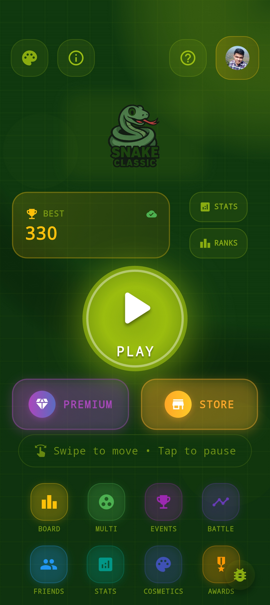
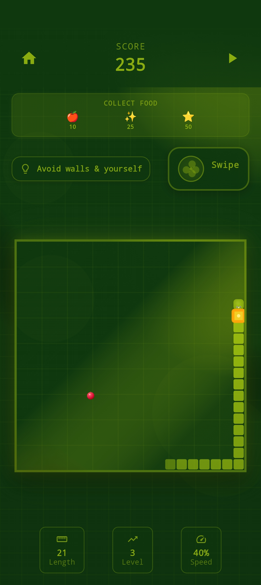
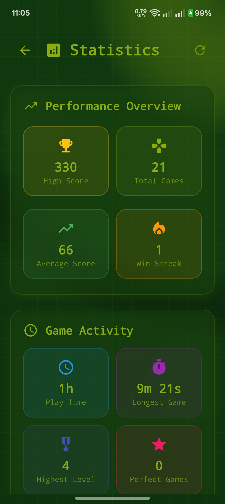
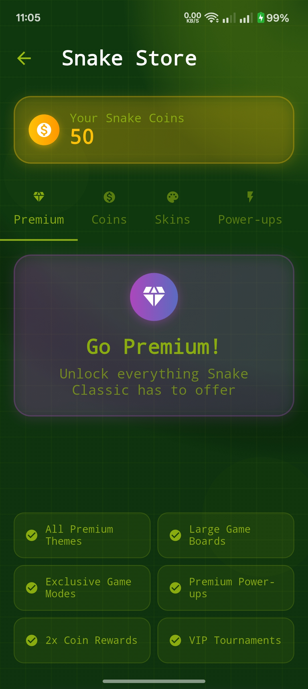
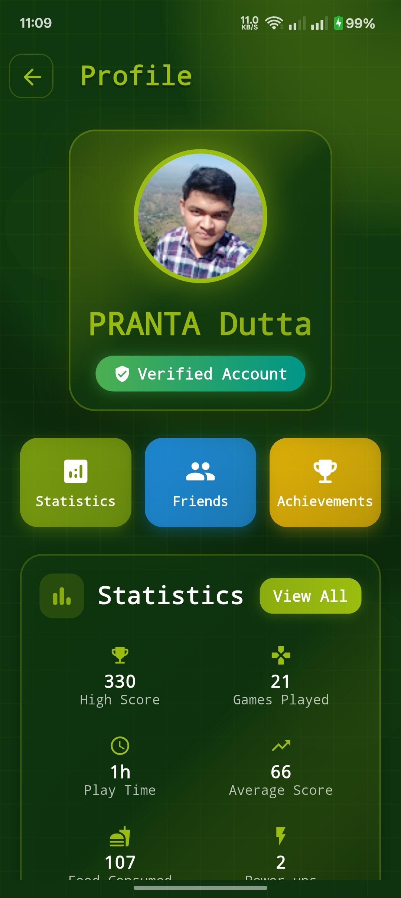

# 🐍 Snake Classic - Flutter Game

A premium, modern implementation of the classic Snake game built with Flutter, featuring stunning visuals, smooth 60FPS gameplay, and immersive audio experience.

## 📸 Screenshots

Experience Snake Classic's beautiful, modern interface and premium game design:

<div align="center">

### 🏠 Home Screen


### 🎮 Gameplay Experience  



### 🏆 Game Over & Statistics



### 🛒 Premium Store & Profile



</div>

*All screenshots showcase the premium UI with smooth animations, consistent theming, and professional game design quality.*

## ✨ Features

### 🎮 Core Gameplay
- **Classic Snake mechanics** with modern enhancements
- **60FPS smooth gameplay** with optimized rendering
- **Grid-based movement** on 20x20 game board
- **Progressive difficulty** - speed increases with level
- **Enhanced crash feedback** - 5-second modal explaining why game ended
- **Multiple food types** with accurate visual representations:
  - 🍎 Apple Food (10 points) - red apple with stem and leaf
  - ✨ Bonus Food (25 points, expires in 15s) - glowing circle with sparkles
  - ⭐ Special Food (50 points) - 8-pointed pulsing star

### 🎨 Visual Experience
- **Six premium themes**:
  - **Classic** - Traditional retro green monochrome
  - **Modern** - Sleek contemporary blue design  
  - **Neon** - Electric cyberpunk with glowing effects
  - **Retro** - Warm earth tones with vintage gaming feel
  - **Space** - Cosmic purple hues for interstellar adventures
  - **Ocean** - Deep sea blues with coral accents
- **Smooth animations** throughout the UI
- **Custom particle effects** for special events
- **Gradient buttons** with haptic feedback
- **Animated snake logo** on home screen
- **Theme selector screen** with live previews and descriptions

### 🌐 Online & Social Features
- **Enhanced Google Sign-In Authentication** with modern API integration and Firebase
- **First-time user onboarding** with beautiful welcome screen and authentication choice
- **Guest mode option** for instant play with upgrade to Google account later
- **Seamless account migration** from guest to Google with data preservation
- **Google account upgrade prompts** in profile screen for guest users
- **Global leaderboards** with real-time updates and user rankings
- **Weekly leaderboards** showcasing recent achievements
- **Friends system** with user search, friend requests, and online status indicators
- **Private leaderboards** for friends-only competitions with podium displays
- **Social profiles** with public/private settings and game statistics
- **User profiles** with comprehensive statistics and progress tracking
- **Cross-platform synchronization** of scores, achievements, and social data
- **Real-time status updates** (online, offline, playing) for friends
- **Secure data persistence** with Firebase Firestore

### 🎮 Real-time Multiplayer
- **1v1 Snake battles** with real-time synchronization
- **Quick match system** for instant gameplay
- **Private room creation** with shareable room codes
- **Multiple game modes**: Classic, Speed Run, Survival, Power-up Madness
- **Real-time player status** (waiting, ready, playing, crashed)
- **Live game state sync** with Firebase real-time database
- **Multiplayer lobby** with player management and game settings
- **Cross-device compatibility** for seamless multiplayer experience

### 📱 Push Notification System
- **Firebase Cloud Messaging** integration for real-time notifications
- **Smart notification targeting** with individual and topic-based messaging
- **5 notification categories** with user preference controls:
  - 🏆 **Tournament alerts** - New tournaments, reminders, results
  - 👥 **Social notifications** - Friend requests, challenges, multiplayer invites  
  - 🎖️ **Achievement unlocks** - Progress celebrations and milestone notifications
  - 📅 **Daily reminders** - Comeback notifications and daily challenges
  - ⭐ **Special events** - Limited-time events and announcements
- **Deep linking navigation** - Notifications navigate directly to relevant screens
- **Backend integration** - Powered by FastAPI notification service
- **Local notifications** - Offline notifications and scheduling
- **Topic subscription management** - Auto-subscribe based on user preferences
- **Cross-platform support** - Works on Android, iOS, and web

### 🎮 Power-ups & Special Abilities
- **4 unique power-up types** with special effects:
  - **⚡ Speed Boost** - Increases snake movement speed temporarily
  - **🛡️ Invincibility** - Protection from wall and self-collisions
  - **⭐ Score Multiplier** - Double points for food consumption
  - **🐌 Slow Motion** - Slows down game speed for precise control
- **Visual power-up indicators** in game HUD with circular progress timers
- **Power-up spawn system** with random generation and visual effects
- **Theme-specific power-up rendering** with glowing animations
- **Power-up statistics tracking** for comprehensive gameplay analytics

### 🏅 Tournament System
- **Multiple tournament types**: Daily Challenges, Weekly Championships, Monthly Events, Special Tournaments
- **6 unique game modes**:
  - **🐍 Classic** - Standard Snake game rules
  - **⚡ Speed Run** - Rapidly increasing game speed
  - **⏱️ Survival** - Focus on survival time over score
  - **🌐 No Walls** - Snake wraps around screen edges
  - **🎆 Power-up Madness** - Frequent power-up spawns
  - **💎 Perfect Game** - One mistake ends the game
- **Real-time tournament leaderboards** with live participant tracking
- **Tournament rewards system** with badges, coins, and special titles
- **Tournament history** and personal statistics tracking
- **Visual tournament indicators** in game HUD during tournament play

### 📊 Advanced Statistics & Analytics
- **50+ detailed statistics** tracked across all gameplay sessions:
  - Game performance metrics (total games, average score, survival rate)
  - Food consumption patterns and power-up usage statistics
  - Collision analysis and consistency ratings
  - Session tracking and daily play patterns
- **Performance trends** with visual charts and analytics insights
- **Streak tracking** for consecutive games and achievements
- **Cross-device synchronization** with Firebase cloud storage
- **AI-generated insights** based on player performance patterns

### 🎬 Game Replay System
- **Complete game recording** with frame-by-frame data capture
- **Replay browser** organized by Recent games, Best performances, and Crash analysis
- **Interactive replay viewer** with playback controls and speed adjustment
- **Crash analysis** with specific crash reasons and visual indicators
- **Replay statistics** showing detailed game performance metrics
- **Cloud storage** for replay synchronization across devices

### 🏆 Achievement System
- **16 unique achievements** across multiple categories:
  - **Score Achievements**: First Bite, Century Club, High Roller, Snake Master, Legendary Serpent
  - **Games Played**: Getting Started, Persistent Player, Dedicated Gamer, Snake Addict
  - **Survival Challenges**: Survivor, Endurance Master
  - **Special Feats**: Wall Avoider, Speedster, Perfectionist, Gourmet
- **Rarity system** (Common, Rare, Epic, Legendary) with unique visual indicators
- **Progress tracking** for locked achievements with completion percentages
- **Animated notifications** for newly unlocked achievements
- **Achievement browser** with filtering and detailed statistics

### 🎵 Audio System
- **Complete sound effects**:
  - Food consumption sounds
  - Game over alerts
  - Level up celebrations
  - Button click feedback
  - High score achievements
- **Background music** with volume controls
- **System sound fallbacks** for reliability

### 🎯 Controls & UX
- **Enhanced swipe detection** with full-screen responsive gestures
- **Visual gesture feedback** with bottom-left direction indicator
- **Haptic feedback** for all interactions
- **Crash feedback system** with detailed explanation modals:
  - 🧱 Wall collision warnings
  - 🐍 Self-collision alerts
  - 5-second auto-continue or tap to skip
- **Comprehensive on-screen instructions** matching actual food visuals
- **Pause/resume functionality**
- **Fully responsive layout** adapting to all screen sizes

### 💾 Persistence & Storage
- **Unified user system** with automatic anonymous authentication
- **Unique username generation** for all users (guest and authenticated)  
- **Real-time Firebase synchronization** for all game data
- **Seamless account migration** from anonymous to Google Sign-In
- **Cross-platform data sync** with automatic conflict resolution
- **Offline-first architecture** with sync queue and connectivity detection
- **Achievement progress** saved locally and in Firebase
- **User preferences** including theme selection and audio settings
- **High score synchronization** across devices (when signed in)
- **Offline support** with local storage fallback for guest users

### 🛠️ Developer Experience
- **Beautiful debug logging system** with categorized output using Talker
- **Service-specific log categories** with emoji indicators for easy debugging:
  - 👤 USER - User system operations  
  - 🔥 FIREBASE - Firebase operations
  - ☁️ SYNC - Data synchronization
  - 🎮 GAME - Game logic
  - 🏆 ACHIEVEMENT - Achievement system
  - 📊 STATS - Statistics
  - 🔊 AUDIO - Audio service
  - 🎨 UI - Theme and UI operations
  - 🚀 LIFECYCLE - App lifecycle events
  - 🌐 NETWORK - Network operations
  - 💾 STORAGE - Local storage operations
- **Debug-only log viewer** accessible via floating action button
- **Production-safe logging** (disabled in release builds)
- **Global error handling** with beautiful crash reporting
- **Route tracking** for navigation debugging

## 🏗️ Architecture

### 📁 Project Structure
```
lib/
├── models/           # Game data models
│   ├── achievement.dart        # Achievement system models
│   ├── food.dart
│   ├── game_replay.dart        # Replay system models
│   ├── game_state.dart
│   ├── game_statistics.dart    # Comprehensive statistics model
│   ├── position.dart
│   ├── power_up.dart           # Power-up system models
│   ├── snake.dart
│   ├── tournament.dart         # Tournament and competition models
│   └── user_profile.dart       # Social features and user profiles
├── providers/        # State management
│   ├── game_provider.dart      # Enhanced with tournament mode support
│   ├── theme_provider.dart
│   └── user_provider.dart      # User authentication state
├── screens/          # UI screens
│   ├── achievements_screen.dart # Achievement browser
│   ├── first_time_auth_screen.dart # Welcome and authentication choice screen
│   ├── friends_leaderboard_screen.dart # Private friend competitions
│   ├── friends_screen.dart     # Social features and friend management
│   ├── game_over_screen.dart   # Enhanced with tournament results
│   ├── game_screen.dart        # Enhanced with tournament indicators
│   ├── home_screen.dart        # Updated navigation to all features
│   ├── leaderboard_screen.dart # Global and weekly leaderboards
│   ├── loading_screen.dart     # App initialization and first-time user detection
│   ├── profile_screen.dart     # User profile and Google upgrade for guests
│   ├── replays_screen.dart     # Game replay browser
│   ├── replay_viewer_screen.dart # Interactive replay playback
│   ├── settings_screen.dart
│   ├── statistics_screen.dart  # Comprehensive game analytics
│   ├── theme_selector_screen.dart # Visual theme browser
│   ├── tournament_detail_screen.dart # Tournament information and joining
│   └── tournaments_screen.dart # Tournament browser and management
├── services/         # Business logic
│   ├── achievement_service.dart # Achievement tracking
│   ├── audio_service.dart
│   ├── backend_service.dart    # Push notification backend communication
│   ├── data_sync_service.dart  # Background data synchronization
│   ├── leaderboard_service.dart # Firestore leaderboards
│   ├── navigation_service.dart # Deep linking and navigation management
│   ├── notification_service.dart # Firebase and local notification management
│   ├── preferences_service.dart # Synced user preferences
│   ├── social_service.dart     # Friend system and social features
│   ├── statistics_service.dart # Advanced gameplay analytics
│   ├── storage_service.dart
│   ├── tournament_service.dart # Tournament management and participation
│   ├── unified_user_service.dart # Comprehensive user management
│   └── username_service.dart   # Username validation and reservation
├── utils/           # Utilities
│   ├── constants.dart          # Enhanced with 6 themes
│   ├── direction.dart
│   ├── logger.dart             # Beautiful debug logging system
│   └── performance_monitor.dart # FPS and performance tracking
└── widgets/         # Reusable components
    ├── achievement_notification.dart # Achievement popups
    ├── animated_snake_logo.dart
    ├── crash_feedback_overlay.dart
    ├── game_board.dart         # Enhanced theme rendering with power-ups
    ├── game_hud.dart           # Enhanced with tournament and power-up indicators
    ├── gradient_button.dart    # Enhanced with nullable callback support
    ├── instructions_dialog.dart
    ├── particle_effect.dart
    ├── pause_overlay.dart
    └── swipe_detector.dart

notification_backend/     # FastAPI Push Notification Backend
├── app/
│   ├── core/          # Configuration and settings
│   ├── models/        # Pydantic data models  
│   ├── routes/        # API endpoints (notifications, users, testing)
│   ├── services/      # Firebase service and scheduler
│   └── main.py        # FastAPI application
├── requirements.txt   # Python dependencies
├── .env.example       # Environment configuration template
├── firebase-admin-key.json.example # Firebase credentials template
├── run.py            # Development server script
└── test_server.py    # Comprehensive testing suite
```

### 🛠️ Technical Stack

#### Flutter Application
- **Flutter** - Cross-platform UI framework (>=3.9.0)
- **Provider** - State management for game state and user data
- **Firebase Core** - Backend infrastructure and authentication
- **Firebase Auth** - User authentication and profile management
- **Firebase Messaging** - Push notification delivery
- **Cloud Firestore** - Real-time database for leaderboards and achievements
- **Google Sign-In** - Modern authentication provider with updated API integration
- **Flutter Local Notifications** - Local notification scheduling and display
- **HTTP** - RESTful API communication with backend services
- **AudioPlayers** - Audio system with AssetSource
- **SharedPreferences** - Local storage and offline support
- **FlutterAnimate** - Smooth animations and visual effects
- **VectorMath** - Game physics and calculations
- **Connectivity Plus** - Network connectivity detection and monitoring
- **Talker & Talker Flutter** - Beautiful debug logging and crash reporting
- **UUID** - Unique identifier generation for sessions and data

#### Backend Services
- **FastAPI** - High-performance Python web framework
- **Firebase Admin SDK** - Server-side Firebase integration
- **APScheduler** - Advanced Python job scheduling
- **Uvicorn** - Lightning-fast ASGI server
- **Pydantic** - Data validation and settings management
- **HTTPx** - Modern HTTP client for Python

## 🎯 Performance Features

- **Custom painting** for 60FPS game board rendering with RepaintBoundary optimization
- **Efficient collision detection** with specific crash reason tracking
- **Memory-optimized** audio management with proper disposal
- **Smooth animations** with home screen performance improvements
- **Responsive gesture recognition** with full-screen detection
- **Square food rendering** preventing visual distortion across different screen ratios
- **Configurable timing constants** for easy maintenance

## 🚀 Getting Started

### Prerequisites
- Flutter SDK (>=3.9.0)
- Dart SDK
- Android Studio / VS Code
- Android device or emulator

### Installation

1. **Clone the repository**
   ```bash
   git clone <repository-url>
   cd snake_classic
   ```

2. **Install dependencies**
   ```bash
   flutter pub get
   ```

3. **Run the app**
   ```bash
   flutter run
   ```

### Development Commands
```bash
flutter pub get          # Install dependencies
flutter run              # Run on default device
flutter run -d android   # Run on Android
flutter run -d chrome    # Run on web browser
flutter analyze          # Static analysis
flutter build            # Build for production
flutter clean            # Clean build cache
```

## 🎮 How to Play

### Controls
- **Swipe Up/Down/Left/Right** - Change snake direction
- **Tap Screen** - Pause/Resume game
- **Arrow Keys / WASD** - Change direction (Desktop)
- **Spacebar** - Pause/Resume (Desktop)

### Gameplay
1. Control the snake to eat food and grow
2. Avoid hitting walls or the snake's own body
3. Collect different food types for bonus points
4. Try to achieve the highest score possible
5. Game speed increases with each level

## 🎨 Customization

### Themes
The game features six distinct visual themes:
- Access via Settings → Visual Theme → Browse Themes
- Each theme has unique color schemes and visual effects
- Theme selection is automatically saved
- Live previews available in theme selector

### Game Settings
- **Board Size**: Choose from Small (15x15), Classic (20x20), Large (25x25), or Huge (30x30)
- **Crash Feedback Duration**: Customize timing from 2-10 seconds
- **Visual Theme**: Select from 6 premium themes with live previews

### Audio Settings
- Toggle sound effects on/off
- Control background music
- Individual volume controls
- Settings persist between sessions

## 🔧 Development Notes

### Code Quality
- **Flutter analyze** passes with minimal warnings
- **Modern Flutter patterns** throughout codebase
- **Proper error handling** with graceful fallbacks
- **Comprehensive documentation** in code

### Performance Optimizations
- Custom `GameBoardPainter` for efficient rendering
- Proper widget lifecycle management
- Optimized collision detection algorithms
- Memory-conscious audio service

### Cross-Platform Support
- **Android** - Primary target platform
- **iOS** - Fully supported
- **Web** - Compatible with responsive design
- **Desktop** - Windows/macOS/Linux support

## 📝 Changelog

### 🚀 Major Feature Updates (Latest Release)
- ✅ **Enhanced Google Sign-In System** - Modern API integration with updated authentication flow
- ✅ **First-Time User Onboarding** - Beautiful welcome screen with Google/Guest authentication choice
- ✅ **Responsive Authentication UI** - Mobile-optimized design with smooth animations and adaptive sizing
- ✅ **Single Loading Experience** - Eliminated double loading screens for smoother user flow
- ✅ **Guest Account Upgrade System** - In-app prompts and upgrade options in profile screen
- ✅ **Unified User System** - Automatic anonymous authentication with unique usernames for all users
- ✅ **Beautiful Debug Logging** - Categorized logging system with Talker integration (debug-only)
- ✅ **Data Synchronization** - Real-time Firebase sync with offline support and conflict resolution
- ✅ **Visual Stability Fixes** - Resolved game board shifting and particle positioning issues
- ✅ **Enhanced Developer Experience** - Service-specific logging with emoji categories and debug viewer
- ✅ **Complete Social System** - Friends, friend requests, online status, private leaderboards
- ✅ **Tournament Mode** - Competitive events with multiple game modes and real-time leaderboards
- ✅ **Power-up System** - 4 special abilities with visual effects and HUD indicators
- ✅ **Game Replay System** - Frame-by-frame recording, playback controls, crash analysis
- ✅ **Advanced Statistics** - 50+ metrics with performance trends and AI insights
- ✅ **Tournament Integration** - In-game HUD indicators and game over notifications
- ✅ **Enhanced UI Navigation** - All features accessible through intuitive home screen layout
- ✅ **Online Leaderboards** - Global and weekly leaderboards with real-time sync
- ✅ **Comprehensive Achievement System** - 16 achievements across 4 categories with rarity levels
- ✅ **Enhanced Visual Themes** - 6 premium themes (Classic, Modern, Neon, Retro, Space, Ocean)
- ✅ **Theme Selector Screen** - Beautiful theme browser with live previews
- ✅ **Firebase Integration** - Complete backend infrastructure for online features
- ✅ **User Profile System** - Profile screen with statistics and sign-in/out functionality
- ✅ **Achievement Notifications** - Animated popups for unlocked achievements
- ✅ **Advanced Theme Effects** - Theme-specific visual effects and rendering enhancements
- ✅ **Custom Game Board Sizes** - Four size options with visual selector and persistence
- ✅ **Customizable Crash Feedback Duration** - User-configurable timing (2-10 seconds)

### Recent Bug Fixes & Improvements
- 🔧 **Game Board Stability** - Fixed gesture indicator causing layout shifts during swipe animations
- 🔧 **Particle Positioning** - Corrected food consumption particles to appear at exact food location
- 🔧 **Null Safety** - Prevented null check operator crashes in leaderboard screen
- 🔧 **Performance Optimization** - Fixed border width, blur radius, and spread radius inconsistencies

### Previous Updates
- ✅ **Crash feedback system** - 5-second modal explaining game over reasons
- ✅ **Visual food improvements** - apple-shaped normal food with proper proportions
- ✅ **Responsive layout fixes** - all screens adapt to different screen sizes
- ✅ **Enhanced gesture controls** - full-screen swipe detection with visual feedback
- ✅ **Home screen performance** - optimized animations and reduced jank
- ✅ **Game instructions accuracy** - icons now match actual rendered food types
- ✅ **Layout optimization** - removed fixed heights, added RepaintBoundary isolation
- ✅ **Constants refactoring** - configurable timing for easy maintenance
- ✅ Complete audio system implementation
- ✅ Premium UI with original three themes
- ✅ Particle effects and animations
- ✅ High score persistence

## 🤝 Contributing

This project follows conventional commit standards:
- `feat:` - New features
- `fix:` - Bug fixes
- `docs:` - Documentation updates
- `style:` - Code formatting
- `refactor:` - Code refactoring
- `perf:` - Performance improvements

## 📄 License

This project is licensed under the MIT License - see the LICENSE file for details.

## 🎯 Development Roadmap

### ✅ Completed Features
- [x] **Online leaderboards** - Global and weekly leaderboards with Firebase
- [x] **Achievement system** - 16 achievements with rarity levels and progress tracking
- [x] **More visual themes** - Added Retro, Space, and Ocean themes (6 total)
- [x] **User authentication** - Google Sign-In and anonymous options
- [x] **Firebase integration** - Complete backend infrastructure
- [x] **Advanced UI/UX** - Theme selector, profile screen, achievement notifications
- [x] **Custom game board sizes** - Four size options (15x15, 20x20, 25x25, 30x30) with visual selector
- [x] **Customizable crash feedback duration** - User-configurable timing (2-10 seconds)
- [x] **Enhanced home screen layout** - Scrollable interface with optimized spacing
- [x] **Power-ups and special abilities** - 4 unique power-ups with visual effects and HUD indicators
- [x] **Game replay system** - Complete frame-by-frame recording and playback with crash analysis
- [x] **Social features** - Comprehensive friend systems, search, requests, and private leaderboards
- [x] **Tournament mode** - Competitive events with 6 game modes and real-time leaderboards
- [x] **Advanced statistics** - 50+ detailed metrics with performance trends and AI insights
- [x] **Multiplayer mode** - Real-time 1v1 battles with Firebase sync, matchmaking, and live gameplay

### 🚧 Upcoming Features
All major features have been implemented! The Snake Classic game is now feature-complete.

---

**Built with ❤️ using Flutter**

*A modern take on the timeless classic that started it all.*