# 🐍 Snake Classic

A modern take on the classic Snake game, built with Flutter and the Flame engine. Ten themes, eight single-player modes, real-time 1v1 multiplayer, tournaments, a battle pass, and a full progression system, all on top of an offline-first local database that syncs to a .NET backend.

## 📲 Download

<table align="center" border="0">
  <tr>
    <td align="center" valign="middle">
      <a href="https://play.google.com/store/apps/details?id=com.pranta.snakeclassic"></a>
    </td>
    <td align="center" valign="middle">
      <a href="https://apps.apple.com/us/app/snake-classic-retro-arcade/id6779621362"></a>
    </td>
  </tr>
</table>

- **Google Play:** [com.pranta.snakeclassic](https://play.google.com/store/apps/details?id=com.pranta.snakeclassic)
- **App Store:** [Snake Classic - Retro Arcade](https://apps.apple.com/us/app/snake-classic-retro-arcade/id6779621362)
- **Source:** [github.com/theprantadutta/snake_classic](https://github.com/theprantadutta/snake_classic)

## 📸 Screenshots

<div align="center">

### 🏠 Home & Gameplay
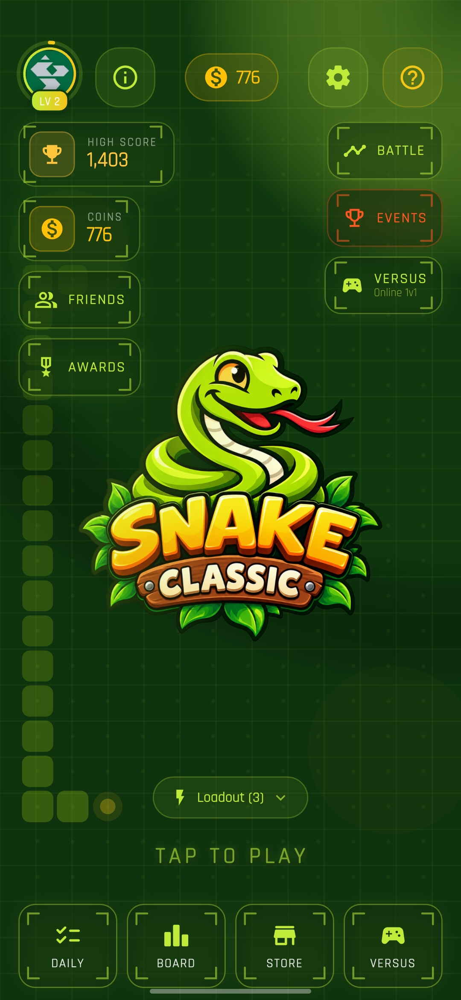
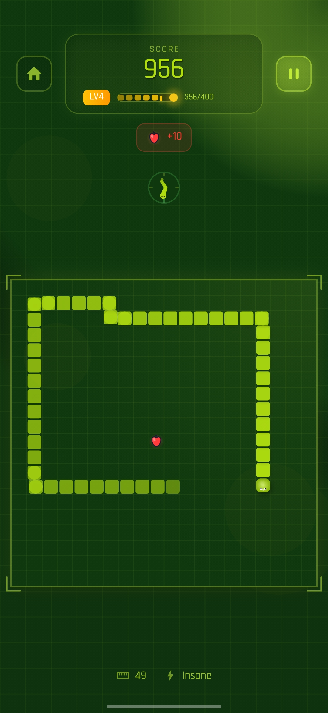
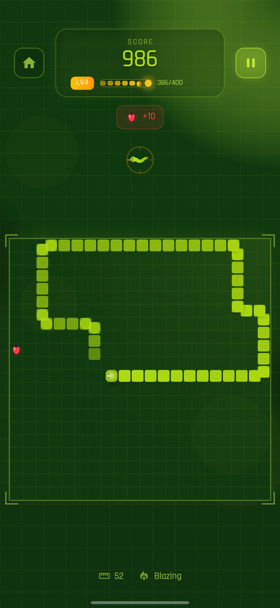

### 🏆 Game Over & Progression
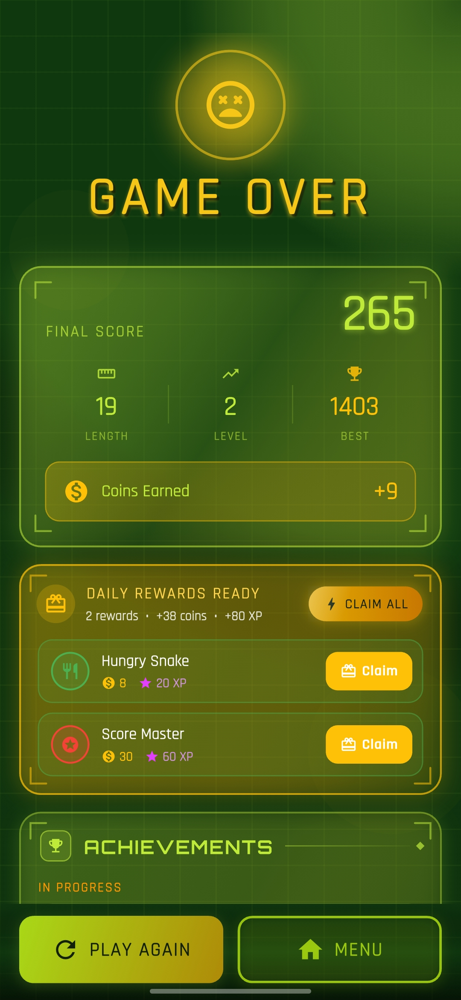
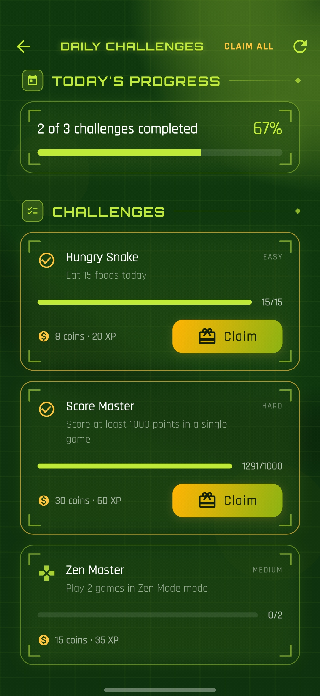
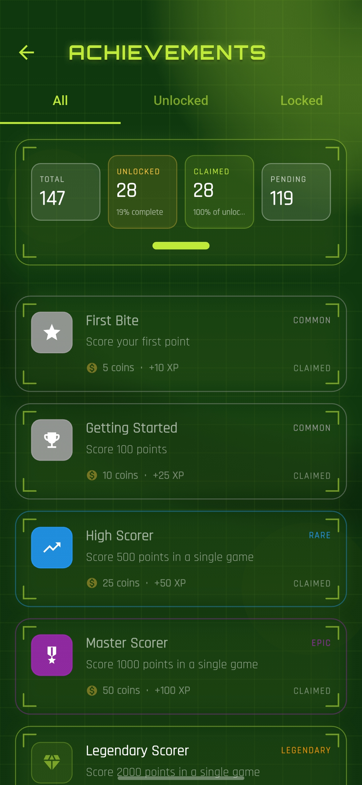

### 🎟️ Battle Pass, Store & Settings
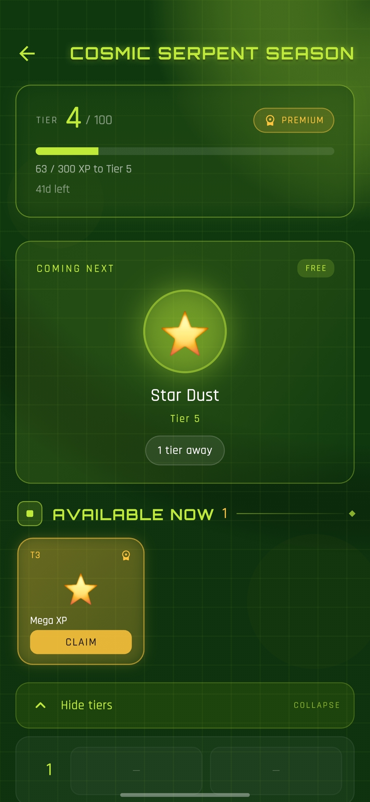
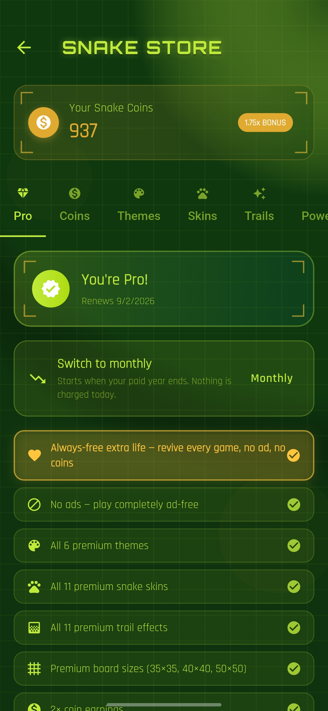
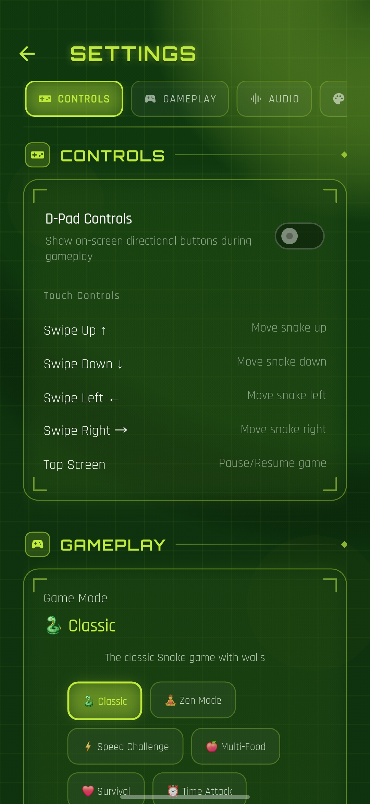

### 👤 Profile & Leaderboards
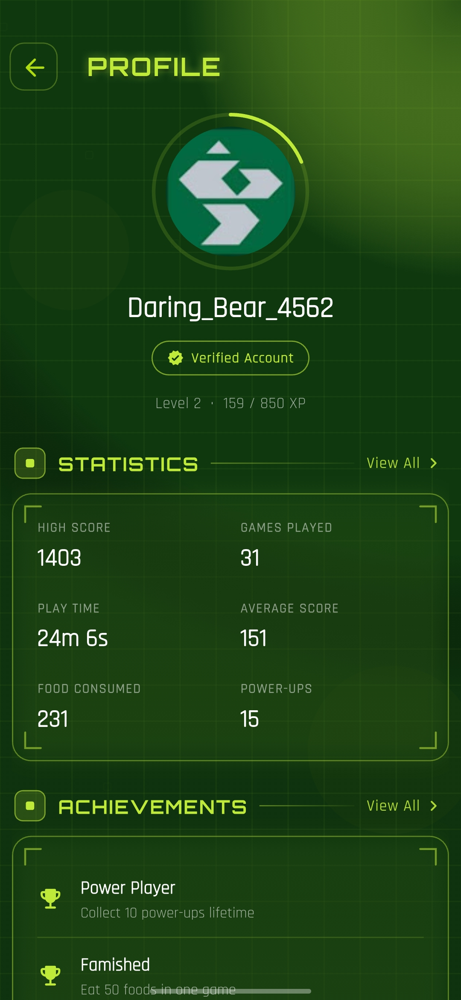
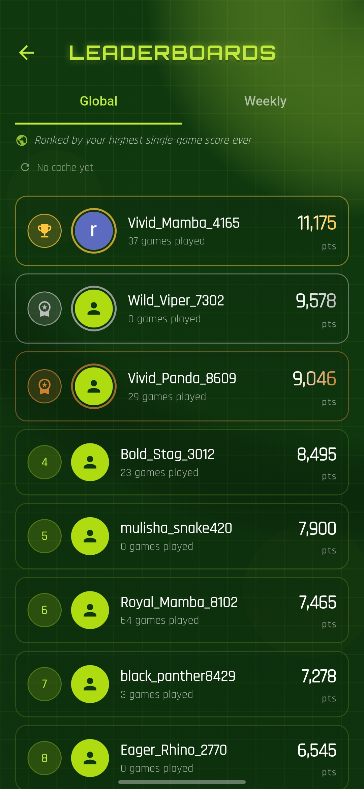

### ⚔️ Real-time Multiplayer
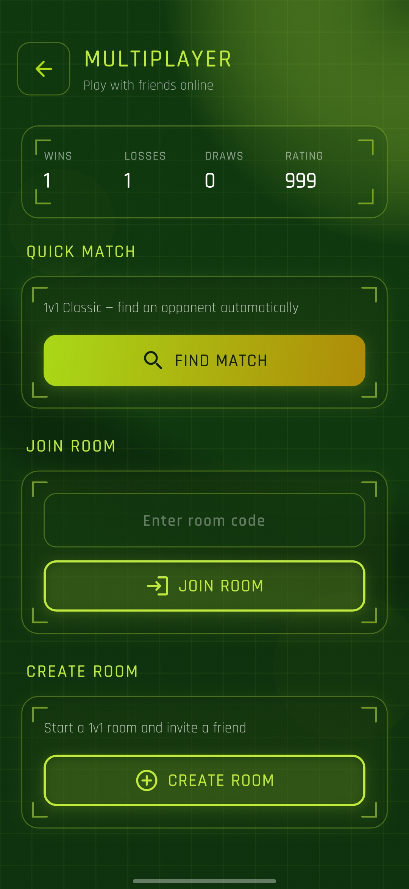
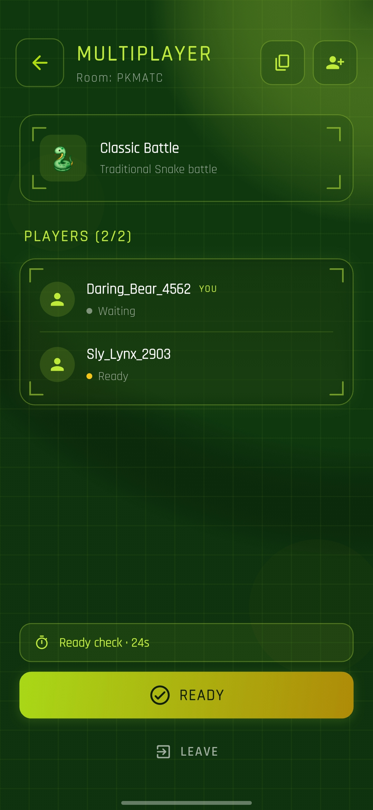
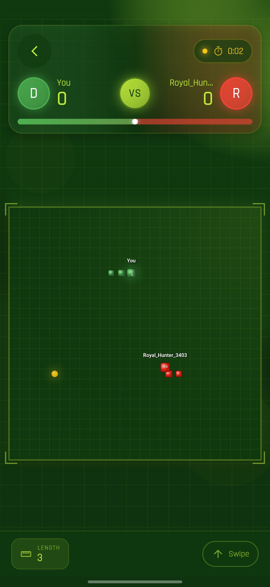
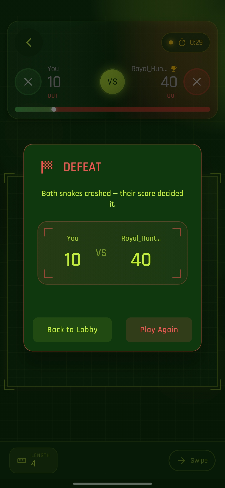

</div>

## ✨ Features

### 🎮 Gameplay
- **Eight single-player modes:** Classic, Zen, Speed Challenge, Multi-Food, Survival, Time Attack, Power-Up Madness, and Perfect Game.
- **Four board sizes** from 15×15 to 30×30, with larger 35×35, 40×40 and 50×50 boards for Pro members.
- **Four power-ups:** Speed Boost, Invincibility, Score Multiplier, and Slow Motion, with HUD timers and a pre-game loadout.
- **Combo system** with a heat meter and decay bar, level progression, and a snake-compass swipe indicator.
- **Revive** after a crash by watching a rewarded ad or spending coins. Pro members revive for free.
- **Crash feedback** that says exactly why the run ended, with a configurable auto-continue.
- **Replays** recorded frame by frame, browsable by recent, best, and crashes, with an interactive viewer.
- **Server-authoritative 1v1 multiplayer** over SignalR: quick match, private rooms with shareable codes, ready checks, reconnect handling, and a house opponent when no human turns up within 30 seconds.

### 🎨 Visuals
- **Ten themes.** Classic, Modern, Neon and Retro are free; Space, Ocean, Cyberpunk, Forest, Desert and Crystal come with Pro or can be bought individually.
- **Premium snake skins and trail effects**, unlockable with coins or included with Pro.
- **Flame-driven rendering** for the board, snakes, food and particles, with interpolated movement in multiplayer.
- **120 Hz support** on devices that offer it, opt-in from Settings.
- **Consistent HUD language:** corner brackets, accent hairlines and themed backdrops shared across every screen.

### 🏆 Progression
- **147 achievements** across score, games played, survival, and special feats, with Common, Rare, Epic and Legendary rarities.
- **Daily challenges** and **weekly quests** with coin and XP rewards.
- **Battle pass** seasons with free and premium tracks.
- **Tournaments** with their own modes, live leaderboards and rewards.
- **Coins economy** earned from play, challenges, achievements and rewarded ads.
- **Detailed statistics** covering play time, food eaten, power-ups used, streaks and trends.

### 🌐 Online & Social
- **Play first.** A new install goes straight to the game as a local guest. Sign-in with Google, email, or an anonymous account is offered once there is progress worth keeping.
- **Global, weekly and friends leaderboards.**
- **Friends system** with search, requests and online status.
- **Cloud sync** of scores, statistics, achievements, purchases and settings, with an offline outbox that drains when connectivity returns.
- **Push notifications** by category: tournaments, social, achievements, daily reminders and special events, each user-controllable.

### 💎 Pro & Monetisation
- **Snake Classic Pro** subscription (monthly or yearly): no ads, every premium theme, skin and trail, larger boards, free revives, and coin bonuses.
- **AdMob** for free users: banners, interstitials, rewarded video and app-open ads, with UMP consent and App Tracking Transparency on iOS.
- **In-app purchases** verified server-side.

### 🌍 Localisation
Available in English, Arabic, Spanish, French, Hindi, Italian, Polish, Portuguese and Russian.

## 🏗️ Architecture

The app is offline-first. Every screen reads from a local **Drift** (SQLite) database, and a sync engine reconciles it with the backend. Gameplay runs through a single end-of-game pipeline that owns rewards, statistics and achievements for both single-player and multiplayer.

```
lib/
├── core/           # Dependency injection (get_it)
├── data/           # Drift database, DAOs, migrations, legacy import
├── game/           # Game engine, tick simulation, Flame rendering
├── l10n/           # ARB files and generated localisations
├── models/         # Domain models
├── presentation/   # BLoC / Cubit state: auth, theme, game, multiplayer, premium, coins...
├── providers/      # Riverpod providers for feature data
├── router/         # go_router routes and pages
├── screens/        # 30 screens
├── services/       # API client, audio, ads, notifications, sync, multiplayer hub...
├── utils/          # Constants, animations, responsive helpers, logging
└── widgets/        # Shared UI: HUD, boards, overlays, buttons, cards
```

See [ARCHITECTURE.md](ARCHITECTURE.md) for the gameplay architecture, invariants and the reasoning behind them.

### 🛠️ Tech Stack

**App**
- Flutter with the Flame engine for rendering
- flutter_bloc and Riverpod for state, get_it for dependency injection
- Drift for the local database, go_router for navigation
- Firebase Auth, Cloud Messaging, Analytics and Crashlytics
- signalr_netcore for real-time multiplayer
- google_mobile_ads and in_app_purchase
- flutter_soloud for audio, flutter_animate for motion

**Backend** (separate repository, `snake-classic-backend`)
- .NET 10 Web API with Clean Architecture
- PostgreSQL via EF Core, Redis, Hangfire for background jobs
- SignalR hub for the match engine, Firebase Admin SDK for auth and push

## 🚀 Getting Started

### Prerequisites
- Flutter with Dart 3.13 or newer (the project is developed on Flutter 3.47)
- An Android device or emulator, or an iOS device or simulator
- A Firebase project (the app reads `firebase_options.dart` and platform config files)
- A running backend, or the production API URL

### Setup

1. Clone and install dependencies:
   ```bash
   git clone https://github.com/theprantadutta/snake_classic.git
   cd snake_classic
   flutter pub get
   ```

2. Create a `.env` file in the project root with the API base URL and keys the app expects. The app loads it at startup and will not boot without it.

3. Run:
   ```bash
   flutter run
   ```

### Useful Commands
```bash
flutter run              # Run on the connected device
flutter analyze          # Static analysis
flutter test             # Run the test suite
flutter gen-l10n         # Regenerate localisations after editing ARB files
flutter build appbundle  # Android release bundle
flutter build ipa        # iOS release archive
```

## 🎮 How to Play

- **Swipe** in any direction to steer. An optional on-screen **D-pad** can be enabled in Settings.
- **Arrow keys or WASD** steer and **Space** pauses when a keyboard is attached.
- Eat food to grow and score. Bonus and special food are worth more but do not wait around.
- Avoid the walls and your own tail. Power-ups bend those rules for a few seconds.
- Speed rises with your level. Chain food quickly to build a combo multiplier.

## 📚 Project Documentation

- [ARCHITECTURE.md](ARCHITECTURE.md) — gameplay architecture and invariants
- [DEPLOYMENT_SETUP.md](DEPLOYMENT_SETUP.md) — release configuration
- [STORE_SETUP.md](STORE_SETUP.md) and [GOOGLE_PLAY_CONSOLE_SETUP.md](GOOGLE_PLAY_CONSOLE_SETUP.md) — store listings and console setup
- [PREMIUM_FEATURES_STATUS.md](PREMIUM_FEATURES_STATUS.md) — what Pro includes and where it is gated
- [NOTIFICATIONS_TESTING.md](NOTIFICATIONS_TESTING.md) — push notification testing
- [RETENTION_PLAN.md](RETENTION_PLAN.md) — the onboarding and retention rationale

## 📄 License

This project is licensed under the MIT License. See [LICENSE](LICENSE) for details.
