# 🐍 Snake Classic

A modern take on the classic Snake game, built with Flutter and the Flame engine and drawn in the **Living Board** design: every screen sits on one glowing pixel grid. Ten themes, eight single-player modes, real-time 1v1 multiplayer, tournaments, a battle pass, and a full progression system, all on top of an offline-first local database that syncs to a .NET backend.

## 📲 Download

<table align="center" border="0">
  <tr>
    <td align="center" valign="middle">
      <a href="https://play.google.com/store/apps/details?id=com.pranta.snakeclassic"></a>
    </td>
    <td align="center" valign="middle">
      <a href="https://apps.apple.com/us/app/snake-classic-retro-arcade/id6779621362"></a>
    </td>
  </tr>
</table>

- **Google Play:** [com.pranta.snakeclassic](https://play.google.com/store/apps/details?id=com.pranta.snakeclassic)
- **App Store:** [Snake Classic - Retro Arcade](https://apps.apple.com/us/app/snake-classic-retro-arcade/id6779621362)
- **Source:** [github.com/theprantadutta/snake_classic](https://github.com/theprantadutta/snake_classic)

## 📸 Screenshots

<div align="center">

### 🏠 Home & Gameplay
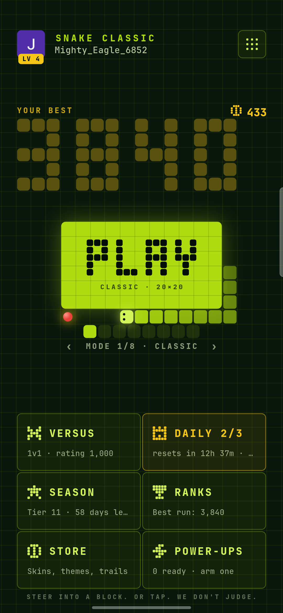
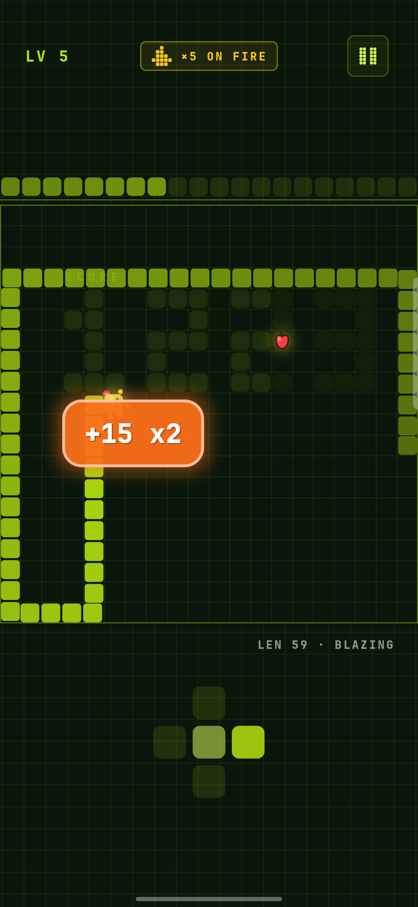
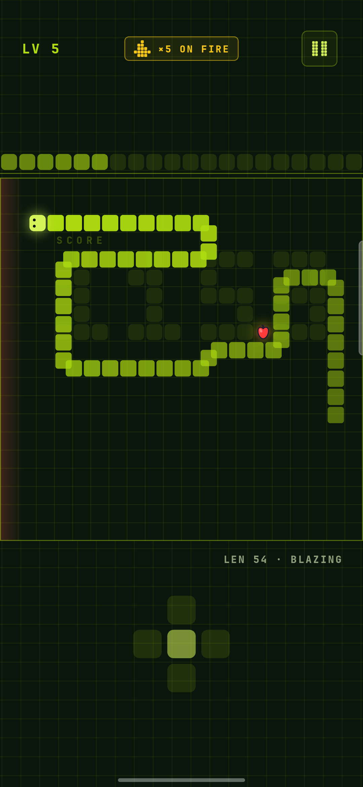

### 🏆 Game Over & Progression
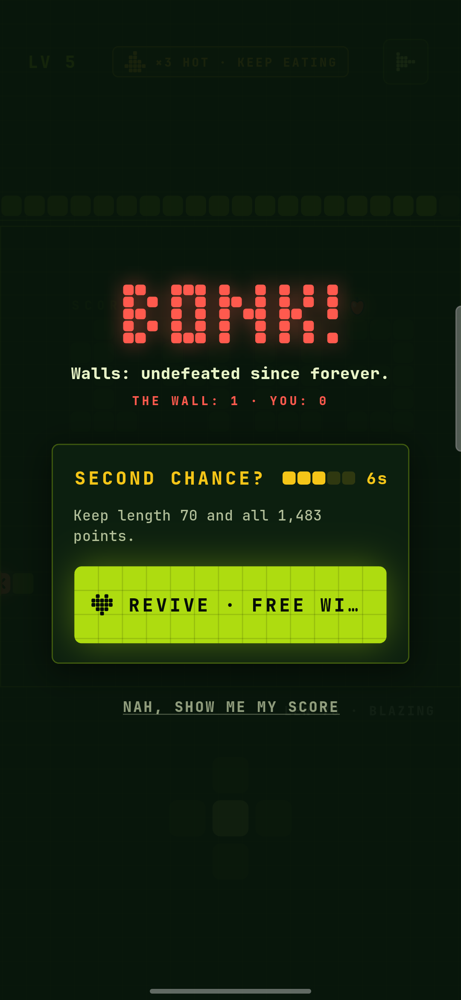
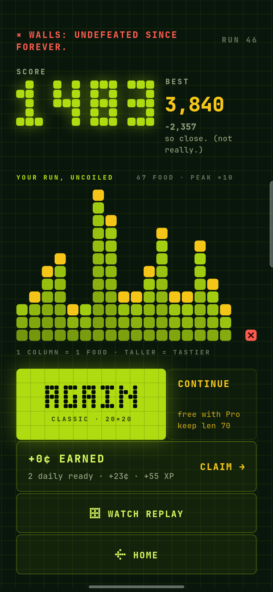
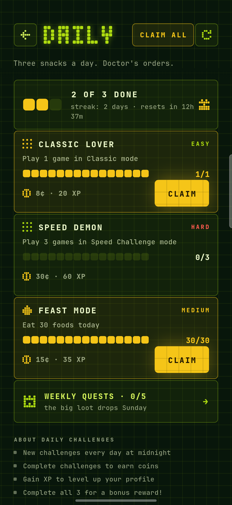

### 🎟️ Season, Store & Settings
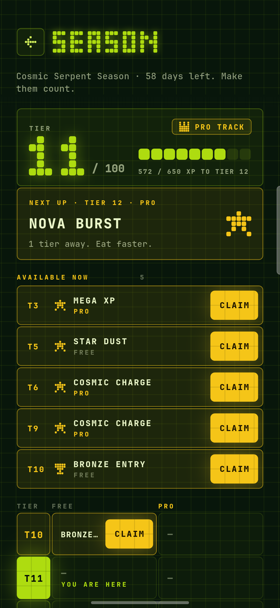
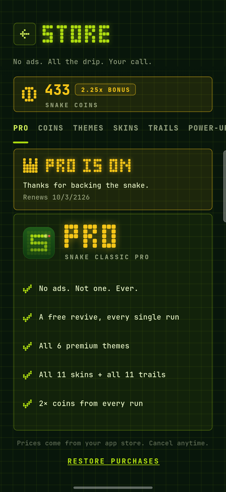
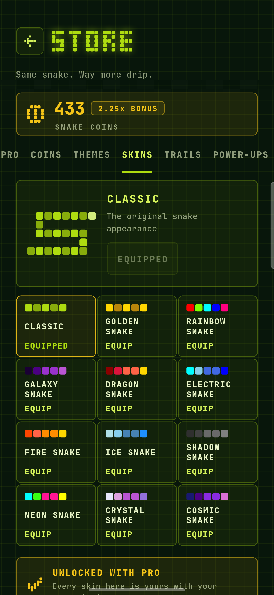

### 👤 Profile, Ranks & Trophies
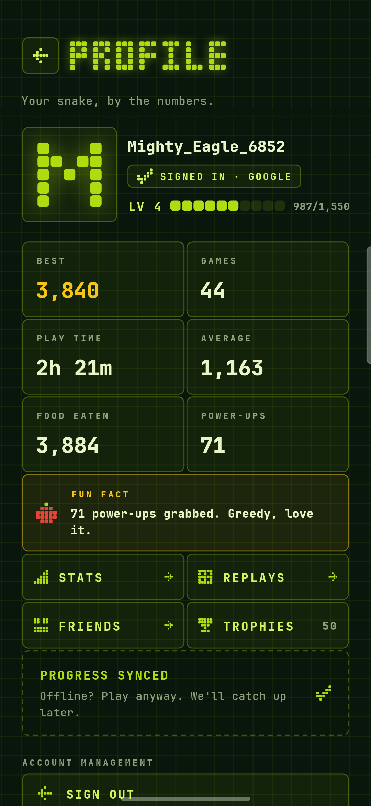
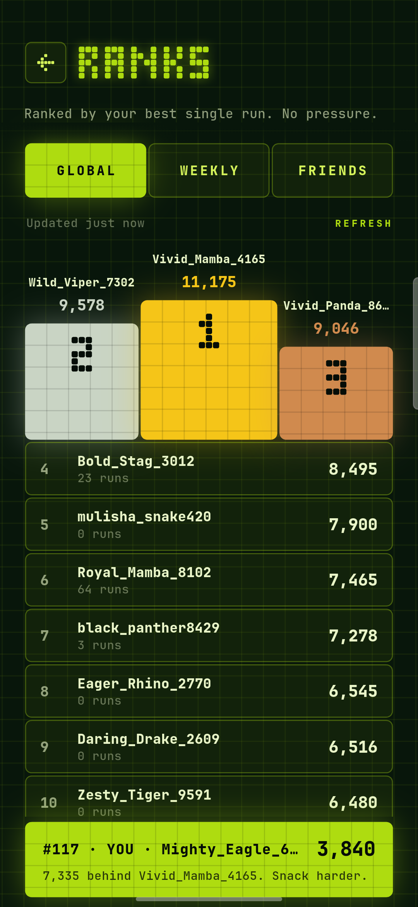
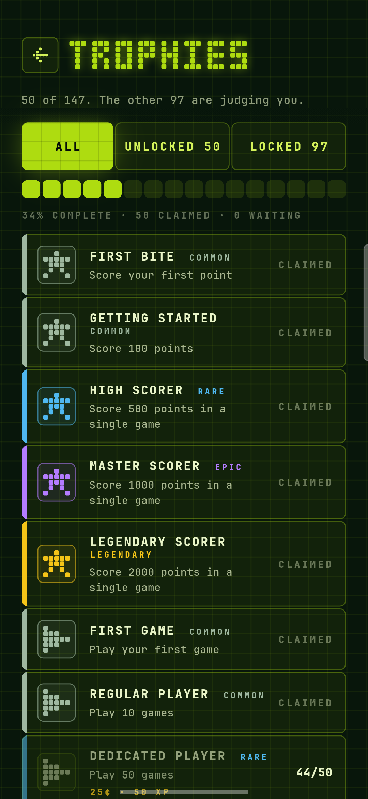

### ⚔️ Real-time Multiplayer
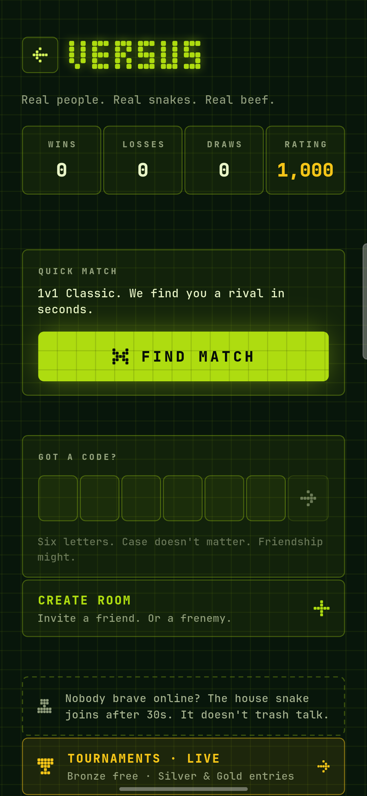
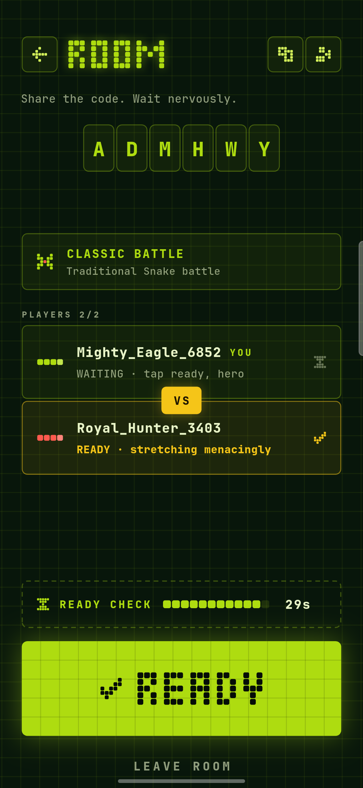
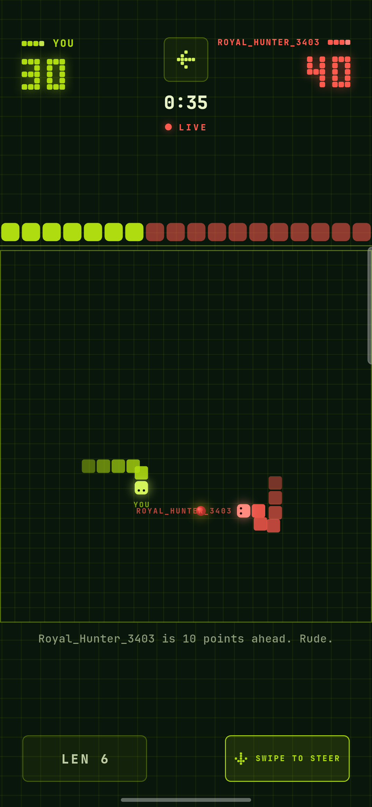
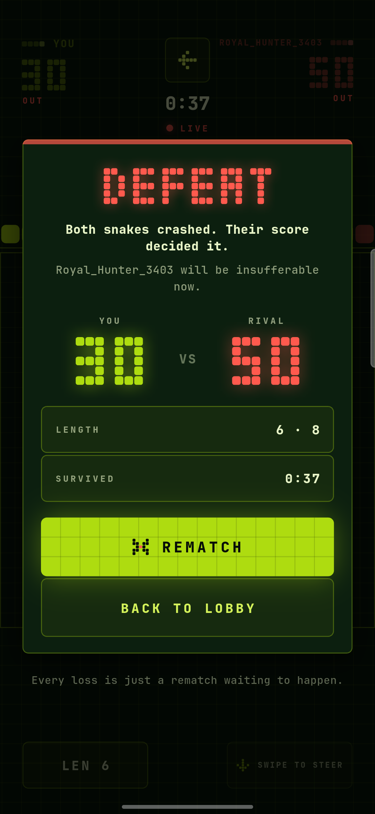

### 📱 Tablet
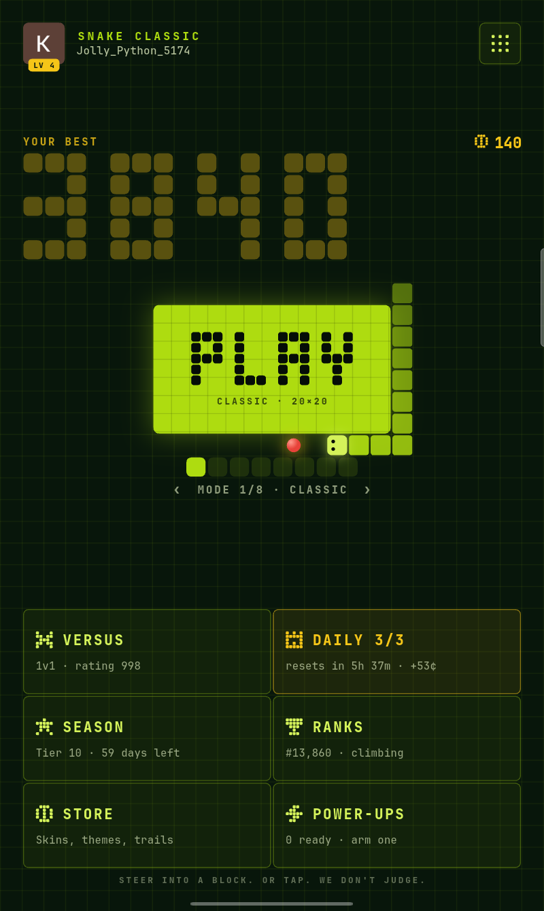
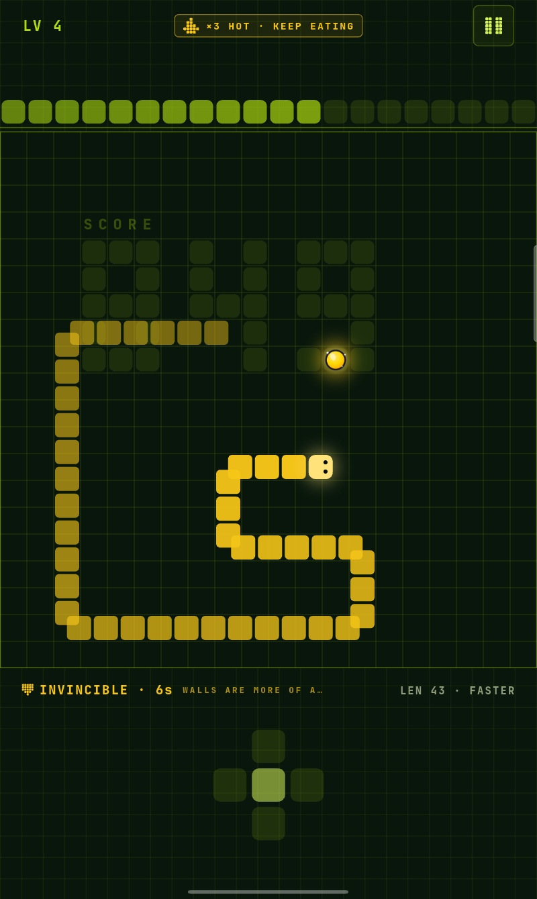
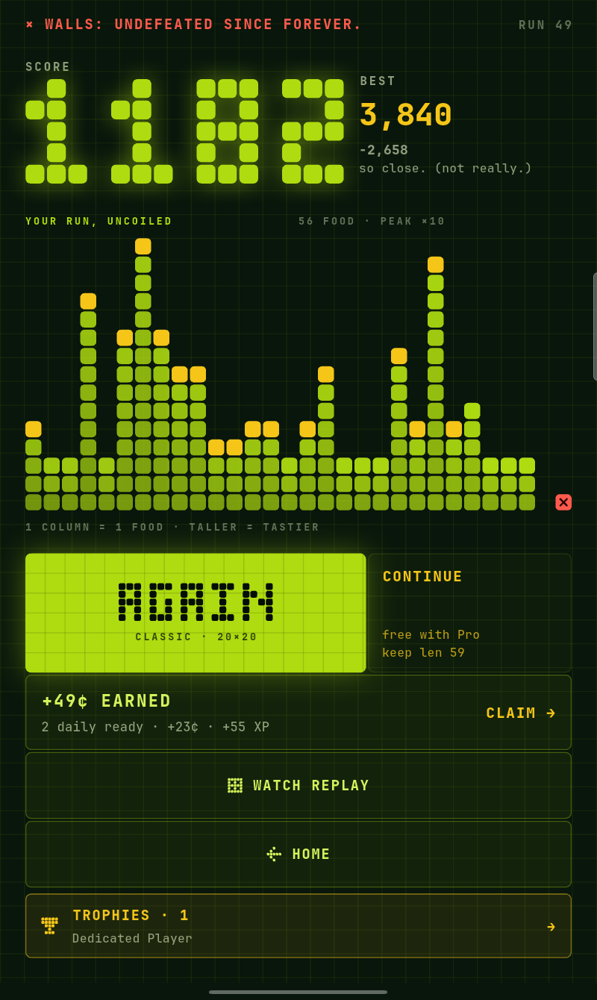

</div>

## ✨ Features

### 🎮 Gameplay
- **Eight single-player modes:** Classic, Zen, Speed Challenge, Multi-Food, Survival, Time Attack, Power-Up Madness, and Perfect Game.
- **Nine board sizes** from 15×15 to 50×50, all free.
- **Run setup** before each game: mode, board and power-up loadout on one screen.
- **Four power-ups:** Speed Boost, Invincibility, Score Multiplier, and Slow Motion, with HUD timers and a pre-game loadout.
- **Combo multiplier** up to ×3 for eating without pause, plus level progression.
- **Four control schemes:** swipe (with a compass under the board), a four-way pad, a floating joystick, and turn buttons, plus keyboard support.
- **Second chance** after a crash: revive by watching a rewarded ad or spending coins, then **continue** once more from the game over screen. Both are free for Pro members.
- **Your run, uncoiled:** the game over screen charts every bite of the run.
- **Crash feedback** that says exactly why the run ended, with a configurable auto-continue.
- **Replays** recorded frame by frame, browsable by recent, best, and crashes, with an interactive viewer.
- **Server-authoritative 1v1 multiplayer** over SignalR: quick match, private rooms with shareable codes, ready checks, reconnect handling, and a house opponent when no human turns up within 30 seconds. The local snake is predicted ahead of the server and both snakes move on render clocks, so matches stay smooth at real-world latency.

### 🎨 Visuals
- **Living Board design.** Every screen, from Home to the store, is built from the same pixel cells as the game board, set in JetBrains Mono, with the "Cell S" app icon. The design kit lives in [docs/living-board/](docs/living-board/).
- **Ten themes** that re-skin the whole grid. Classic, Modern, Neon and Retro are free; Space, Ocean, Cyberpunk, Forest, Desert and Crystal come with Pro or can be bought individually.
- **12 snake skins and 11 trail effects**, unlockable with coins or included with Pro.
- **Flame-driven rendering** for the board, snakes, food and particles.
- **Its own sound set and music**, with a menu loop and a separate in-run loop.
- **Tablets and iPads** get a scaled-up portrait layout, not a stretched phone screen.
- **120 Hz support** on devices that offer it, opt-in from Settings.

### 🏆 Progression
- **147 achievements** across score, games played, survival, and special feats, with Common, Rare, Epic and Legendary rarities.
- **Daily challenges** and **weekly quests** with coin and XP rewards.
- **Season:** a 100-tier pass with free and premium tracks.
- **Tournaments** with their own modes, live leaderboards and rewards.
- **Coins economy** earned from play, challenges, achievements and rewarded ads.
- **Detailed statistics** covering play time, food eaten, power-ups used, streaks and trends.

### 🌐 Online & Social
- **Play first.** A new install goes straight to the game as a local guest. Sign-in with Google, email, or an anonymous account is offered once there is progress worth keeping.
- **Global, weekly and friends leaderboards**, with your rank and the gap to the next spot.
- **Friends system** with search, requests and online status.
- **Cloud sync** of scores, statistics, achievements, purchases and settings, with an offline outbox that drains when connectivity returns.
- **Push notifications** by category: tournaments, social, achievements, daily reminders and special events, each user-controllable.

### 💎 Pro & Monetisation
- **Snake Classic Pro** subscription (monthly or yearly): no ads, every premium theme, skin and trail, the premium Season track, free revives and continues, 2× coins, 5 of each power-up every month, and tournament entries each billing cycle.
- **AdMob** for free users: banners, interstitials, rewarded video and app-open ads, with UMP consent and App Tracking Transparency on iOS.
- **In-app purchases** verified server-side.

### 🌍 Localisation
Available in English, Arabic, Spanish, French, Hindi, Italian, Polish, Portuguese and Russian.

## 🏗️ Architecture

The app is offline-first. Every screen reads from a local **Drift** (SQLite) database, and a sync engine reconciles it with the backend. Gameplay runs through a single end-of-game pipeline that owns rewards, statistics and achievements for both single-player and multiplayer.

```
lib/
├── core/           # Dependency injection (get_it)
├── data/           # Drift database, DAOs, migrations, legacy import
├── game/           # Game engine, tick simulation, Flame rendering
├── l10n/           # ARB files and generated localisations
├── models/         # Domain models
├── presentation/   # BLoC / Cubit state: auth, theme, game, multiplayer, premium, coins...
├── providers/      # Riverpod providers for feature data
├── router/         # go_router routes and pages
├── screens/        # Route-level screens
├── services/       # API client, audio, ads, notifications, sync, multiplayer hub...
├── utils/          # Constants, animations, responsive helpers, logging
└── widgets/        # Shared UI; lb/ is the Living Board design system, lb_screens/ its screen parts
```

See [ARCHITECTURE.md](ARCHITECTURE.md) for the gameplay architecture, invariants and the reasoning behind them.

### 🛠️ Tech Stack

**App**
- Flutter with the Flame engine for rendering
- flutter_bloc and Riverpod for state, get_it for dependency injection
- Drift for the local database, go_router for navigation
- Firebase Auth, Cloud Messaging and Analytics
- Sentry for crash reporting, tracing and session replay
  (`lib/core/observability/`; full write-up in `SENTRY.md` in the workspace root)
- signalr_netcore for real-time multiplayer
- google_mobile_ads, and flutter_inapp_purchase (OpenIAP) for the store — Play Billing Library 9.1 / StoreKit 2
- flutter_soloud for audio, flutter_animate for motion

**Backend** (separate repository, `snake-classic-backend`)
- .NET 10 Web API with Clean Architecture
- PostgreSQL via EF Core, Redis, Hangfire for background jobs
- SignalR hub for the match engine, Firebase Admin SDK for auth and push

## 🚀 Getting Started

### Prerequisites
- Flutter with Dart 3.13 or newer (the project is developed on Flutter 3.47)
- An Android device or emulator, or an iOS device or simulator
- A Firebase project (the app reads `firebase_options.dart` and platform config files)
- A running backend, or the production API URL

### Setup

1. Clone and install dependencies:
   ```bash
   git clone https://github.com/theprantadutta/snake_classic.git
   cd snake_classic
   flutter pub get
   ```

2. Create a `.env` file in the project root with the API base URL and keys the app expects. The app loads it at startup and will not boot without it.

3. Run:
   ```bash
   flutter run
   ```

### Useful Commands
```bash
flutter run              # Run on the connected device
flutter analyze          # Static analysis
flutter test             # Run the test suite
flutter gen-l10n         # Regenerate localisations after editing ARB files
./tools/release_android.sh  # Play release bundle + Sentry debug symbols (use this, not a bare build)
./tools/release_ios.sh      # App Store equivalent (not yet run end to end)
```

## 🎮 How to Play

- **Swipe** in any direction to steer, or switch to the on-screen **pad**, **joystick** or **turn buttons** in Settings or the pause menu.
- **Arrow keys or WASD** steer and **Space** pauses when a keyboard is attached.
- Eat food to grow and score. Bonus and special food are worth more but do not wait around.
- Avoid the walls and your own tail. Power-ups bend those rules for a few seconds.
- Speed rises with your level. Chain food quickly to build a combo multiplier.
- Crashed? Take the second chance, or continue once from the game over screen.

## 📚 Project Documentation

- [ARCHITECTURE.md](ARCHITECTURE.md) — gameplay architecture and invariants
- [DEPLOYMENT_SETUP.md](DEPLOYMENT_SETUP.md) — release configuration
- [STORE_SETUP.md](STORE_SETUP.md) and [GOOGLE_PLAY_CONSOLE_SETUP.md](GOOGLE_PLAY_CONSOLE_SETUP.md) — store listings and console setup
- [PREMIUM_FEATURES_STATUS.md](PREMIUM_FEATURES_STATUS.md) — what Pro includes and where it is gated
- [NOTIFICATIONS_TESTING.md](NOTIFICATIONS_TESTING.md) — push notification testing
- [RETENTION_PLAN.md](RETENTION_PLAN.md) — the onboarding and retention rationale
- [docs/living-board/](docs/living-board/) — the Living Board design kit: spec, copy deck, tokens and reference screens
- [store_listings/](store_listings/) — store listing copy and release notes in 10 languages
- Store art: `play_store_screenshots/` and `tablet_play_store_screenshots/` (marketing sets), `screenshots/` and `tablet_screenshots/` (raw captures), `marketing/` (icon and feature graphic)

## 📄 License

This project is licensed under the MIT License. See [LICENSE](LICENSE) for details.
